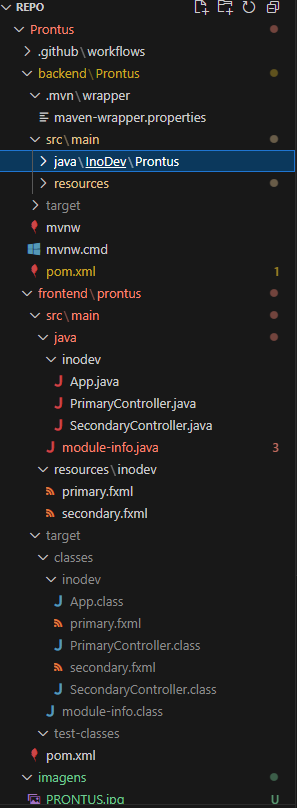

<!--
***Obrigado por visitar o repositório do Prontus! 💚
  ***Este projeto foi desenvolvido com o objetivo de criar um sistema web robusto e eficiente, utilizando Java (Spring Boot) no backend e Node.js (React) no frontend. Através de uma arquitetura bem definida, com integração com bancos de dados como PostgreSQL, buscamos oferecer uma solução escalável e confiável para a gestão de dados.
  ***Se você tiver sugestões, dúvidas ou quiser contribuir com melhorias, sinta-se à vontade para abrir uma issue ou enviar um pull request.
  ***Obrigado novamente! Agora é hora de explorar o Prontus e aproveitar um sistema completo e eficiente! 🚀
-->

<!--LOGO -->

 

  

     
  

<!-- Indice tabelas -->

  
 Sumario

  <ol>
    <li>
      <a href="#sobre-o-projeto">Sobre o projeto</a>
    </li>
    <li>
      <a href="#-workflow-de-trabalho-git-github-merge-de-branches">Workflow de Trabalho</a>
    </li>
    <li>
      <a href="#-back-end">Back-end</a>
    </li>
    <li>
      <a href="#-front-end">Front-end</a>
    </li>
    <li>
      <a href="#-manual-do-usuário">Manual do Usuario</a>
    </li>
    <li>
      <a href="#-como-executar-o-projeto">Como executar o projeto</a>
    </li>
    <li>
      <a href="#-contribuições">Contribuições</a>
    </li>
    <li>
      <a href="#integrantes">Integrantes</a>
    </li>
    <li>
      <a href="#licença">Licença</a>
    </li>
    <li>
      <a href="#contatos">Contatos</a>
    </li>
  </ol>

<!-- Sobre o projeto -->

## Sobre o projeto

O Sistema de Clínica Médica da Prontus é uma aplicação desenvolvida para otimizar a rotina de clínicas e consultórios médicos, centralizando o controle de pacientes, médicos e agendamentos em um só lugar. A ferramenta resolve problemas comuns de gestão, como erros de marcação, prontuários desorganizados e dificuldade no acesso a informações. Com funcionalidades como cadastro de pacientes e médicos, agenda com horários disponíveis e prontuário eletrônico, o sistema atende especialmente clínicas de pequeno e médio porte que buscam mais eficiência e organização no dia a dia.

### 🛠 Tecnologias Utilizadas 

[![Java][Java.dev]][Java-url] [![MySQL][MySQL.dev]][MySQL-url] [![Spring][Spring.dev]][Spring-url]

[![Swagger][Swagger.dev]][Swagger-url] [![Scene Builder][Scene.dev]][Scene-url]

(<a href="#readme-top">Voltar ao topo</a>)

## 🔄 Workflow de Trabalho (Git, GitHub, Merge de Branches)

Durante o desenvolvimento do projeto, utilizamos o **Git** como sistema de versionamento e o **GitHub** como plataforma de colaboração em equipe. A equipe era composta por 6 integrantes, distribuídos entre as áreas de front-end, back-end e documentação.

#### 🛠️ Uso do Git para Versionamento

Cada integrante manteve o controle das suas alterações localmente com o Git, utilizando commits frequentes e descritivos para facilitar o rastreamento do histórico do projeto. O versionamento seguiu uma lógica de separação clara por área de atuação, evitando conflitos e promovendo um fluxo de trabalho organizado.

#### 🌿 Criação e Fusão de Branches

Adotamos um modelo baseado em múltiplas branches especializadas, com a seguinte estrutura:

- `main`: branch principal, que recebeu apenas a versão final e consolidada do projeto.
- `dev`: utilizada para integrar o front-end com o back-end e realizar os testes de integração.
- `front`: utilizada pelas 3 pessoas responsáveis pelo desenvolvimento do front-end.
- `back`: utilizada pelas 3 pessoas responsáveis pelo desenvolvimento do back-end.
- `doc`: utilizada por 2 membros (um do front e um do back) para elaborar a documentação.

Cada integrante fazia *push* diretamente na branch correspondente à sua área (ex: `front`, `back`, `doc`). Após o desenvolvimento inicial, a branch `dev` foi utilizada como ponto de integração entre o front-end e o back-end. Quando todas as partes estavam finalizadas e testadas, um único *merge* foi feito da `dev` para a `main`, concluindo o projeto.

#### 🔁 Pull Requests e Code Review

Todas as contribuições passavam por **pull requests** (PRs) no GitHub. Para manter a qualidade e o controle do código, duas pessoas eram **sorteadas aleatoriamente** a cada PR para revisar e aprovar a solicitação antes do merge. Esse processo garantiu que o código fosse verificado por diferentes membros da equipe, promovendo aprendizado mútuo e melhorando a padronização do código.

### 🔄 Workflow de Desenvolvimento

#### Integração Contínua com GitHub Actions

Para garantir qualidade, organização e automação no fluxo de desenvolvimento, o repositório conta com configurações de **GitHub Actions** aplicadas às branches principais de desenvolvimento.

#### Geração Automática de Pull Requests

As branches `back` e `front` possuem workflows configurados da seguinte forma:

- Sempre que um push é realizado em `back` ou `front`, uma GitHub Action é executada automaticamente.
- Essa action cria um Pull Request (PR) direcionado para a branch `dev`, facilitando a integração contínua entre os módulos de front-end e back-end.

#### Sorteio Automático de Revisores

Para manter a qualidade do código e incentivar a colaboração entre a equipe, outro GitHub Action é responsável por:

- Sortear automaticamente **2 revisores** dentre os participantes do repositório assim que um novo PR é aberto para a branch `dev`.
- O merge do PR na branch `dev` só é permitido após a aprovação de **pelo menos 1** dos revisores sorteados.

(<a href="#readme-top">Voltar ao topo</a>)

---

### 🔧 Back-end

- Desenvolvimento da API REST com Java e Spring.
- Implementação do cadastro e autenticação de usuários (médicos e pacientes).
- Lógica de agendamento de consultas e prevenção de conflitos de horário.
- Criação e manipulação de prontuário eletrônico.
- Integração com banco de dados MySQL.
- Documentação dos endpoints utilizando Swagger.

---

### 🎨 Front-end

- Construção das telas de login, cadastro e navegação principal utilizando JavaFX e Scene Builder.
- Implementação da interface da agenda para marcação e visualização de horários disponíveis.
- Desenvolvimento das telas de visualização e edição de prontuários médicos.
- Integração da interface com os serviços da API back-end.

---

### 🌿 Estrutura de Branches

O projeto é versionado por meio de uma organização clara de branches:

- `back` – Contém toda a lógica e estrutura do back-end.
- `front` – Responsável pelo desenvolvimento da interface e interações do front-end.
- `doc` – Branch dedicada à documentação técnica e funcional do projeto.
- `dev` – Ambiente de integração onde o front-end, back-end e documentação são unificados.
- `main` – Branch final, usada para o deploy e transição dos dados do projeto finalizado.

(<a href="#readme-top">Voltar ao topo</a>)

<!-- Inicio -->

## 📘 Manual do Usuário

Este manual tem como objetivo orientar os funcionários do hospital sobre como utilizar o sistema de forma prática e eficiente. O sistema foi desenvolvido para facilitar o gerenciamento de cadastros, consultas e prontuários médicos, por meio de uma interface simples e intuitiva.

### 👥 Perfis de Usuário

O sistema possui quatro tipos de usuários, cada um com permissões específicas:

- **ADM_SUPER**: responsável pela gestão de outros administradores.
- **ADM**: responsável pelo cadastro e gestão de médicos e recepcionistas.
- **RECEPCIONISTA**: responsável pelo cadastro de pacientes e agendamento de consultas.
- **DOCTOR (Médico)**: responsável pelo atendimento e preenchimento de prontuários.

---

### 🔐 Acesso ao Sistema

Todos os perfis iniciam o uso do sistema acessando a tela de **Login** com seu usuário e senha cadastrados. Após o login, cada usuário será direcionado para a tela correspondente ao seu perfil.

### 🧑‍💼 ADM_SUPER – Administrador Geral

**Funcionalidades disponíveis:**

1. Acessar a **tela de login**.
2. Tela inicial **lista de ações que pode realizar**.
3. Cadastrar novos **administradores (ADM)**.
4. Visualizar a **lista de administradores já cadastrados**.

---

### 🧑‍💼 ADM – Administrador

**Funcionalidades disponíveis:**

1. Acessar a **tela de login**.
2. Tela inicial **lista de ações que pode realizar**.
3. Cadastrar novos **médicos**.
4. Cadastrar novos **recepcionistas**.
5. Visualizar a **lista de médicos cadastrados/lista de recepcionistas cadastrados**.

---

### 🧑‍💼 RECEPCIONISTA

**Funcionalidades disponíveis:**

1. Acessar a **tela de login**.
2. Tela inicial **lista de ações que pode realizar**.
3. Cadastrar **novos pacientes**.
4. Visualizar a **lista de pacientes cadastrados**.
5. Acessar a aba de **agendamento de consultas**.
6. Verificar a **lista de consultas agendadas**.

---

### 🩺 DOCTOR – Médico

**Funcionalidades disponíveis:**

1. Acessar a **tela de login**.
2. Tela inicial **lista de ações que pode realizar**.
3. Acessar a **aba de Consultas** para ver sua agenda de atendimentos.
4. Acessar e preencher a **ficha de prontuário** dos pacientes.

(<a href="#readme-top">Voltar ao topo</a>)

<!-- Uso -->
## 🚀 Como Executar o Projeto

Sistema web com backend em Java (Spring Boot) e frontend em Node.js. Este guia explica como instalar, configurar e executar o projeto localmente.

## 🛠 Instalação de Ferramentas

Antes de iniciar o desenvolvimento, você deve instalar as seguintes ferramentas:

- [Visual Studio Code](https://code.visualstudio.com) – Editor recomendado
- [MySQL](https://www.mysql.com) – Banco de dados alternativo
- [PostgreSQL (recomendado)](https://www.postgresql.org) – Banco de dados principal
- [Spring Boot](https://spring.io/projects/spring-boot) – Framework backend
- [Swagger](https://swagger.io) – Para documentação e testes de APIs

### 🔌 Extensões do VS Code (Java)

Para trabalhar com Java no VS Code, é necessário instalar o pacote `Extension Pack for Java`. Siga os passos abaixo:

1. Copie e cole o seguinte link no navegador:  
   `vscode:extension/vscjava.vscode-java-pack`  
   

2. Clique na opção `Abrir Visual Studio Code`:  
   

3. Instale o pacote clicando em `Install`:  
   

4. Alternativamente, abra o VS Code, vá até o ícone de extensões e pesquise por **"Extension Pack for Java"**:  
   

## ✅ Requisitos Técnicos

### 🔧 Backend (Java):
- **Java 17+** – [Instalar JDK](https://adoptium.net/)
- **Maven 3.8+** – [Instalar Maven](https://maven.apache.org/install.html)

### 💻 Frontend (Node.js):
- **Node.js 16+ e npm** – [Instalar Node.js](https://nodejs.org/)

### 🗄️ Banco de Dados:
- **PostgreSQL** (recomendado – versão 13+)
  - Configure um banco e ajuste os dados de conexão em `backend/Prontus/src/main/resources/application.properties`.

## Rodando o Projeto
Siga os passos abaixo para rodar o projeto Prontus na sua máquina:

Clonar o repositório

Primeiro, clone o repositório para o seu computador. Abra o terminal e execute o comando apropriado para clonar o repositório.

Rodar o backend (Java + Spring Boot)

Vá até o diretório do backend do projeto.

Instale as dependências do projeto usando o Maven e inicie a aplicação.

O backend ficará disponível em http://localhost:8080.

Rodar o frontend (Node.js + React)

Abra um novo terminal e vá até o diretório do frontend.

Instale as dependências do frontend e, em seguida, inicie o servidor do frontend.

O frontend será aberto em http://localhost:3000 no seu navegador.

### ⚠️ Importante: 
O backend precisa estar rodando antes de abrir o frontend, pois o frontend depende da API do backend para funcionar corretamente.

### 🚫 Possíveis erros e soluções
Cannot connect to database → Verifique se o PostgreSQL está em execução e se as credenciais estão corretas.

JAVA_HOME not set → Adicione a variável de ambiente JAVA_HOME com o caminho do JDK.

npm: command not found → Verifique se o Node.js está instalado corretamente.

Failed to fetch no frontend → Confirme se o backend está ativo em localhost:8080.

(<a href="#readme-top">Voltar ao topo</a>)

## 🤝 Contribuições
Para contribuir com o projeto

Fork este repositório.  
Crie uma branch: git checkout -b minha-nova-funcionalidade.  
Faça suas alterações e commit: git commit -m 'Adiciona nova funcionalidade'.  
Envie para o GitHub: git push origin minha-nova-funcionalidade.  
Abra um Pull Request.

(<a href="#readme-top">Voltar ao topo</a>)

<!-- INTEGRANTES -->
## Integrantes

Este projeto foi desenvolvido por um time dedicado e apaixonado por tecnologia. Cada integrante trouxe o seu conhecimento, experiência e criatividade, contribuindo de forma única em cada etapa do desenvolvimento.

- Arthur Araújo Marzano 

- Arthur Augusto Alves Araújo

- Bernardo Braga Gomes Carvalho

- Gabriel Arthur Ferreira De Jesus

- Isaac Adrian de Souza

- João Lucas da Costa bernardo

A colaboração entre as diferentes áreas foi essencial para transformar ideias em soluções funcionais. Sem o esforço coletivo, este projeto simplesmente não teria saído do papel. 

### Desenvolvedores:

(<a href="#readme-top">Voltar ao topo</a>)

<!-- LICENÇA -->
## Licença

Este projeto está licenciado sob os termos da Licença `MIT`.

A Licença `MIT` é uma licença de software permissiva que permite ampla reutilização do código, incluindo uso comercial, modificação, distribuição e sublicenciamento, desde que os devidos créditos aos autores originais sejam mantidos.

Essa escolha visa promover a colaboração, a reutilização do código e o desenvolvimento de soluções abertas e acessíveis.

Para mais informações, consulte o arquivo `LICENSE` incluído neste repositório.

(<a href="#readme-top">Voltar ao topo</a>)

<!-- CONTATOS -->
## Contatos

Gabriel Arthur - [@gbriel.js](https://www.instagram.com/gbriel.js/) - gbl48287@gmail.com

Arthur Araújo - [@marzan.0](https://www.instagram.com/marzan.0/) - arthuramarzano10@gmail.com

Arthur Augusto - [@arthur__alves06](https://www.instagram.com/arthur__alves06/) - alves2araujo@gmail.com

Bernardo Braga - [@bragaxz9](https://www.instagram.com/bragaxz9/)

Isaac Adrian - [@isaac_souzzz](https://www.instagram.com/isaac_souzzz/)

João Lucas - [@joaolucasgym](https://www.instagram.com/joaolucasgym/)

Project Link: [https://github.com/Maarzano/Prontus](https://github.com/Maarzano/Prontus)

(<a href="#readme-top">Voltar ao topo</a>)

<!-- LINKS & IMAGENS -->
[contributors-shield]: https://img.shields.io/github/contributors/github_username/repo_name.svg?style=for-the-badge
[contributors-url]: https://github.com/github_username/repo_name/graphs/contributors
[forks-shield]: https://img.shields.io/github/forks/github_username/repo_name.svg?style=for-the-badge
[forks-url]: https://github.com/github_username/repo_name/network/members
[stars-shield]: https://img.shields.io/github/stars/github_username/repo_name.svg?style=for-the-badge
[stars-url]: https://github.com/github_username/repo_name/stargazers
[issues-shield]: https://img.shields.io/github/issues/github_username/repo_name.svg?style=for-the-badge
[issues-url]: https://github.com/github_username/repo_name/issues
[license-shield]: https://img.shields.io/github/license/github_username/repo_name.svg?style=for-the-badge
[license-url]: https://github.com/github_username/repo_name/blob/master/LICENSE.txt
[linkedin-shield]: https://img.shields.io/badge/-LinkedIn-black.svg?style=for-the-badge&logo=linkedin&colorB=555
[linkedin-url]: https://linkedin.com/in/linkedin_username
[product-screenshot]: images/screenshot.png

[Java.dev]: https://img.shields.io/badge/java-%23ED8B00.svg?style=for-the-badge&logo=openjdk&logoColor=white
[Java-url]: https://www.java.com/pt-BR/

[Swagger.dev]: https://img.shields.io/badge/-Swagger-%23Clojure?style=for-the-badge&logo=swagger&logoColor=white
[Swagger-url]: https://swagger.io/

[MySQL.dev]: https://img.shields.io/badge/mysql-4479A1.svg?style=for-the-badge&logo=mysql&logoColor=white
[MySQL-url]: https://www.mysql.com/

[Spring.dev]: https://img.shields.io/badge/spring-%236DB33F.svg?style=for-the-badge&logo=spring&logoColor=white
[Spring-url]: https://spring.io/projects/spring-boot

[Scene.dev]: https://img.shields.io/badge/JavaFX%20Scene%20Builder-007396?style=for-the-badge&logo=java&logoColor=white
[Scene-url]: https://gluonhq.com/products/scene-builder/
